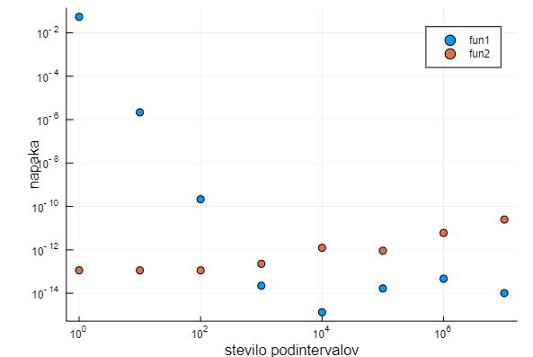

# Gaussove kvadrature
[Gaussove kvadrature](https://en.wikipedia.org/wiki/Gaussian_quadrature) se uporablja za približno računanje določenih integralov. Enačba na intervalu [-1, 1] je:
```math
\int_{-1}^{1}f(x)dx\approx \sum^n_{i=1}w_if(x_i)
```
kjer so $` w_i `$ uteži za vozlišča $` x_i `$ Vozlišča so določena kot ničle polinoma stopnje n, ki ga uporabimo za računanje Gaussovih kvadratur. 

## Gauss-Legendre
Če uporabimo Legendrov polinom druge stopnje dobimo Gauss-Legendreovo integracijsko pravilo na dveh točkah, z vozlišči $` x_1 = -1/\sqrt(3) `$ in $` x_2 = 1/\sqrt(3) `$. Uteži w določimo z metodo nedoločenih koficientov. Vzemimo, da je funkcija f(x) polinom 1. stopnje:
```math
f(x) = x
```

Če uporabimo to funkcijo v enačbi Gaussove kvadrature za dve točki dobimo:

```math
\int_{-1}^{1}f(x)dx = w_1 f(x_1) + w_2 f(x_2) \\
0 = w_1 x_1 + w_2 x_2
```

Zaradi simetričnosti intervala je $` x_1 = -x_2 `$. Če vstavimo vrednosti ničel Legendrovega polinoma 2. stopnje lahko določimo vrednosti za uteži w:

```math
0 = w_1 -1/\sqrt(3) - w_2 1/\sqrt(3) \\
w_1 = w_2 = 1
```

Če ne bi bile ničle Legendreovega polinoma že znane, bi lahko na podoben način določili tudi vrednosti za vozlišča x, le da bi za f(x) vzeli še polinom 2. stopnje.

## Sestavljeno pravilo
Izpeljano Gauss-Legendreovo pravilo lahko uporabimo za bolj natančno aproksimacijo integrala, tako da razbijemo interval na več delov, izračunamo približke za vsakega posebej in jih nato seštejemo. To opisuje sestavljeno pravilo:

```math
\int_{a}^{b}f(x)dx = \int_{a}^{a+h}f(x)dx + \int_{a+h}^{a+2h}f(x)dx + ... +\int_{b-h}^{b}f(x)dx
```

Ker je prejšna enačba Gauss-Legendreovega pravila definirana na intervalu [-1, 1], je potrebno preslikati na poljuben interval [a, b]:

```math
\int_{a}^{b}f(x)dx\approx \frac{b-a}{2} \sum^n_{i=1}w_if(\frac{b-a}{2}x_i+\frac{a+b}{2})
```

## Napaka
Aproksimacija integrala z Gaussovimi kvadraturami je natančna za polinome do stopnje 2n-1. Če želimo določiti napako aproksimacije je potrebno za f(x) vzeti polinom 4. stopnje $` f(x) = x^4 `$, vstaviti vrednosti w, x in določiti konstanto C za napako $`Cf^{(4)}(\xi) `$. $` \xi `$ je točka, ki se nahaja na določenem intervalu.

```math
\int_{-1}^{1}x^4dx = w_1x^4 + w_2x^4 + Cf^{(4)}(\xi) \\
\frac{2}{5} = 1/9 + 1/9 + 24C \\
C=1/135
```

Tako dobimo točno dvotočkovno Gauss-Legendrovo pravilo na intervalu [-1, 1]:

```math
\int_{-1}^{1}f(x)dx = f(-1/ \sqrt(3)) + f(1/ \sqrt(3)) + 1/135f^{(4)}(\xi)
```

Napako na poljubnem intervalu [a, b] lahko določimo s konstanto:
```math
C = \frac{18(b^5-a^5) - 100b - 80a}{2160}
```

Takšno enačbo napake zaradi kompleksnosti določitve višjih odvodov funkcije v praski ne uporabljamo. Raje vzamemo kvadraturo višjega reda ter tako zmanjšamo napako.

## Primer
Integral funkcije $` sin(x)/x `$ (na sliki fun1) na intervalu [0, 5] aproksimiramo s sestavljenim dvotočkovnim Gauss-Legendreovim pravilom. Z 122 podintervali lahko dosežemo natančnost za več kot 10 decimalk:

```jldoctest ;
julia> f = 1.549931244944674137274408400730639012183184893966372210477969710681487208951511074986007223927691325;
julia> fun(x) = sin(x)/x;
julia> I = gauss_quad(fun, 0, 5, 122);
julia> e = abs(f - I)
9.729905769972902e-11
```

Za računanje integrala polinoma tretje stopnje $` 7*(x^3) - 8*(x^2) - 3*x - 3 `$ (na sliki fun1) na intervalu [0, 5] ni potrebno uporabiti sestavljeno pravilo, saj je kvadratura dveh točk točna za to funkcijo. 

```jldoctest ;
julia> f = 8495/12;
julia> fun(x) = 7*(x^3) - 8*(x^2) - 3*x - 3;
julia> I = gauss_quad(fun, 0, 5, 1);
julia> e = abs(f - I)
1.1368683772161603e-13
```

Na sliki lahko vidimo graf napake aproksimacije integrala v odvisnosti od števila podintervalov. 



## Koda
```@autodocs
Modules = [NumMat, Base]
Pages = ["gl_kvadrature.jl"]
Order   = [:function, :type]
```
