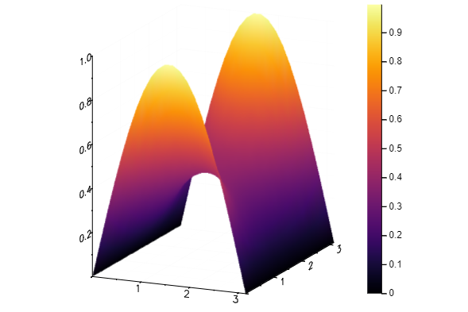

# Pasovne diagonalno dominantne matrike

V praksi velikokrat naletimo na razpršene matrike: matrike, ki večinoma vsebujejo ničelne elemente in le nekaj neničelnih. Lasntnosti razpršenih matrik lahko izkoristimo pri algoritmih numerične matematike, tako da obdelujemo in shranimo le neničelne elemente. [Pasovna matrika](https://sl.wikipedia.org/wiki/Pasovna_matrika) je razpršena matrika, kjer se vsi neničelni elementi nahajajo na glavni diagonali ter na $k1$ spodnjih in $k2$ zgornjih diagonalah. Da je diagonalno dominantna mora veljati tudi

```math
|a_{ii}|\ge\sum_{j\not=i}|a_{ij}|.
```

Takšno strukturo lahko izkoristimo, tako da definiramo tip `PasovnaMatrika`, ki vsebuje števili $k1$ in $k2$ ter matriko (k1+k2+1 x n dimenzij) diagonal razvrščenih v stolpce: 
najprej $k1$ spodnjih diagonal, nato glavna diagonala, ki ji sledi še $k2$ zgornjih diagonal. Podobno definiramo tudi `ZgornjePasovnaMatriko`, ki hrani le spodnje in glavno diagonalo ter `SpodnjePasovnaMatrika`, ki hrani le zgornje in glavno diagonalo.

Primer kreiranja pasovne matrike $P$:

```jldoctest
julia> A = [0 0 3 4 1 ;0 6 7 8 1;9 10 11 12 0;13 14 15 0 0]
4×5 Array{Int64,2}:
  0   0   3   4  1
  0   6   7   8  1
  9  10  11  12  0
 13  14  15   0  0

julia> P = pasovnaMatrika(2,2,A)
pasovnaMatrika{Int64}(2, 2, [0 0 … 4 1; 0 6 … 8 1; 9 10 … 12 0; 13 14 … 0 0])

julia> polna(P)
4×4 Array{Float64,2}:
 3.0   4.0   1.0   0.0
 6.0   7.0   8.0   1.0
 9.0  10.0  11.0  12.0
 0.0  13.0  14.0  15.0
```

Za omenjene tipe implementiramo funkcije za:

- indeksiranje: `Base.getindex`,`Base.setindex!`,`Base.firstindex` in `Base.lastindex`
- množenje z desne `Base.*` z vektorjem
- `lu`, ki izračuna LU-razcep brez pivotiranja, če je matrika diagonalno
   dominantna, sicer pa javi napako. Vrnjena faktorja naj bosta tipa `SpodnjePasovnaMatrika` in `ZgornjePasovnaMatrika`.
- „deljenje“ z leve `Base.\`. Pri `SpodnjePasovnaMatriki` uporabimo direktno vstavljanje, pri `ZgornjePasovnaMatriki` 
    obratno vstavljanje, pri `PasovnaMatriki` pa rešimo enačbo $Ax=b$ s pomočjo LU razcepa.
- Dodatno smo implementirali še funkciji `polna`, ki izpiše matriko s preostalimi, nepasovnimi elementi in funkcijo `pasovnaLaplace` s katero generiramo pasovno Laplaceovo 2D matriko za reševanje minimalnih ploskev.

Funkcijam lahko zmanjšamo zahtevnost, tako da operiramo le na pasovnih elementih.

## Primer
Poleg boljše časovne zahtevnosti nam pasovne matrike omogočajo reševanje večjih sistemov enačb, katerih polne matrike ni mogoče shraniti v pomnilnik. Npr. za Laplacevo matriko dimenzij 102400x102400, na običajnem prenosniku z 7GB spomina ni možno rešiti problema [minimalnih ploskev](https://gitlab.com/nummat/nummat-1920/blob/master/docs/src/vaje/2_linearni_sistemi/03_minimalne_ploskve.md#), saj nam julia javi *OutOfMemoryError()*. Naša `pasovnaMatrika` pa je za isti problem velika le 102400x641, kar lahko obdelujemo (čeprav bi porabili veliko časa - glej spodaj).

Spodaj je pikazan primer reševanja minimalnih ploskev dimenzij 20x20 s pasovno matriko.

```jldoctest
using Plots
robni_problem = RobniProblemPravokotnik(
    LaplaceovOperator(2),
    ((0, pi), (0, pi)),
    [sin, y->0, sin, y->0] 
)
Z, x, y = resiPasovna(robni_problem, nx = 20, ny = 20)
surface(x, y, Z)
```



## Opomba

Potrebno je omeniti, da kljub teoretični boljši časovni zahtevnosti pasovnih matrik naša rešitev deluje malo počasneje od običajnih polnih matrik. Problem se nahaja v funkciji `lu(pasovnaMatrika)`, ki kljub optimizaciji, da obdeluje le diagonalne elemente, potrebuje več časa kot lu razcep polne matrike. Razlog za to je uporaba funkcij `getindex` in `setindex!` za indeksiranje elementov razpšene matrike. Funkcijo bi pohitrili, če bi direktno operirali na shranjenih diagonalah. Res pa je tudi, da je vgrajena lu funkcija bolj optimizirana.

Za rešitev problema z Laplaceovo polno matrike dimenzij 10000x10000 potrebujemo povprečno okoli 60 sekund (od tega malo več kot 59 sekund za LU razcep). Za rešitev problema z Laplaceovo pasovno matriko dimenzij 10000x201 potrebujemo povprečno okoli 70 sekund (od tega okoli 69 sekund za LU razcep). 
Rezultati testiranja z benchmarkom, ki primerja mojo implementacijo `lu` z implementacijo za `SparseMatrixCSR`:

```jldoctest
julia> include("test/benchmarks/domaca_1.jl")
BenchmarkTools.TrialRatio: 
  time:             10.861825602602952
  gctime:           5.424463788191328
  memory:           8.58392241863072
  allocs:           652.1601006207652
```
