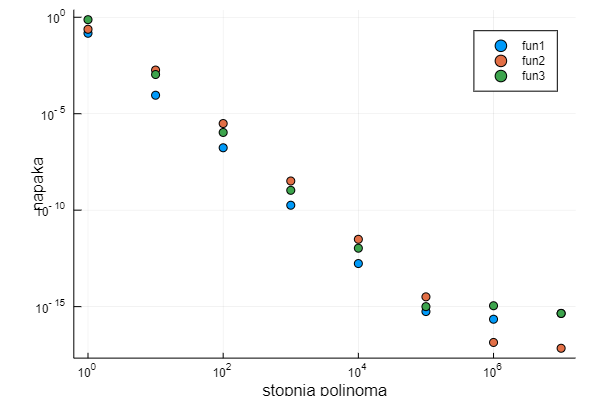
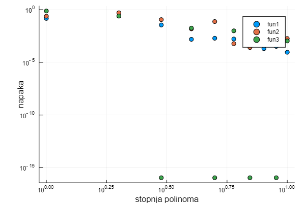

# Lagrangeva interpolacija

Polinomska interpolacija je določanje polinoma najmanjše stopnje, ki vsebuje vse podane vrednosti funkcije, ki jo želimo interpolirati. S polinomom, ki je lažje izračunljiv kot prvotna funkcija, lahko nato določimo (interpoliramo) vmesne vrednosti. Ena od metod interpolacije je [Lagrangeva polinomska interpolacija](https://en.wikipedia.org/wiki/Lagrange_polynomial), pri kateri uporabimo Lagrangeve bazne polinome $li$:
```math
l_j(x) = \prod_{m\neq j} \frac{x - x_m}{x_j - x_m}
```
za določitev interpolacijskega polinoma $L(x)$:
```math
L(x) = \sum^k_{j=1} y_j l_j
```
## Baricentrična oblika
Za hitrejše računanje lahko uporabimo baricentrično obliko, kjer določimo uteži $\lambda$ tako, da nam ni potrebno računati vrednosti vseh $li$ vsakič, ko želimo pridobiti vrednost $L(x)$. Enačba se zato poenostavi v:
```math
L(x)=\begin{cases}
\frac{\sum\frac{f(x_{j})\lambda_{j}}{x-x_{j}}}{\sum\frac{\lambda_{j}}{x-x_{j}}} & x\not=x_{j}\\
f(x_{j}) & \text{sicer}
\end{cases}
```

## Čebiševe točke
Za vozlišča interpolacije se ponavadi vzame Čebiševe točke, ker zmanjšajo vpliv Rungejevega pojava (osciliranje na robovih polinoma) v primerjavi z enakomerno porazdeljenimi točkami. Za interval [-1, 1] so vozlišlča izračunana po naslednji formuli:
```math
cos(\frac{(2i-1)\pi}{2n}); i=1, ...,n
```

## Uteži 
Uteži so določene s spodnjo formulo in izračunane vnaprej, da poenostavijo interpolacijo.
```math
\lambda=\begin{cases}
(-1)^{i} & 0< i <1\\
(-1)^{i}\frac{1}{2} & i=0,n.
\end{cases}
```

## Preslikava
Ker so Čebiševe točke določene za interval [-1, 1], jih je pred interpolacijo potrebno preslikati na interval, kjer imamo določeno funkcijo. To naredimo z običajno linearno preslikavo x iz intervala [a, b] na interval [c, d]:
```math
p(x) = \frac{d-c}{b-a}*(x-a)+c;
```

## Primer
Interpolacijo testiramo na 3 funkcijah $e^{-x^2}$ na [-1, 1], $\frac{sin(x)}{x}$ na [0, 10] in $x^2 - 2x$ na [1, 3]. Da napaka interpolacije ne preseže $10^{-6}$ moramo za funkcijo $e^{-x^2}$ uporabiti vsaj polinom stopnje 50, za $\frac{sin(x)}{x}$ polinom stopnje 131 in za $x^2 - 2x$ polinom stopnje 110.

```jldoctest ;
julia> fun1(x) = MathConstants.e^-x^2
julia> fun2(x) = sin(x)/x
julia> fun3(x) = x^2 - 2*x

julia> x = fun1(-0.4);
julia> i = bar_inter(fun1, -0.4, -1, 1, 50);
julia> e = abs(x-i)
2.2233668417470653e-7

julia> x = fun2(3);
julia> i = bar_inter(fun2, 3, 0, 10, 131);
julia> e = abs(x-i)
2.5622959753945906e-8

julia> x = fun3(1.5);
julia> i = bar_inter(fun3, 1.5, 1, 3, 110);
julia> e = abs(x-i)
8.027454825310087e-7
```
Na sliki je prikazan graf napake od odvisnosti od stopnje interpolacijskega polinoma za vse tri funkcije.



Ob bolj podrobni analizi lahko vidimo, da napaka ne pada linearno s številom stopnje polinomov ampak v nekaterih primerih oscilira, kar lahko vidimo na spodnji sliki. Za funkcijo $x^2 - 2x$ doseže veliko natančnost že s polinomom 3. stopnje nato pa oscilira med postopoma padajočo napaka in okoli $10^{-16}$ veliko napako. Predpostavljam, da pride do velike natančnost, ko imamo liho število Čebišejevih točk, s katerimi lahko dobro interpoliramo to funkcijo.  

```jldoctest ;
julia> fun3(x) = x^2 - 2*x
julia> x = fun3(1.5);

julia> chebyeshev_nodes(3)
3-element Array{Float64,1}:
  0.8660254037844387
  6.123233995736766e-17
 -0.8660254037844387

julia> i = bar_inter(fun3, 1.5, 1, 3, 3);
julia> e = abs(x-i)
1.1102230246251565e-16

julia> chebyeshev_nodes(4)
4-element Array{Float64,1}:
  0.9238795325112867
  0.38268343236508984
 -0.3826834323650897
 -0.9238795325112867

julia> i = bar_inter(fun3, 1.5, 1, 3, 4);
julia> e = abs(x-i)
0.017766952966368876
```


