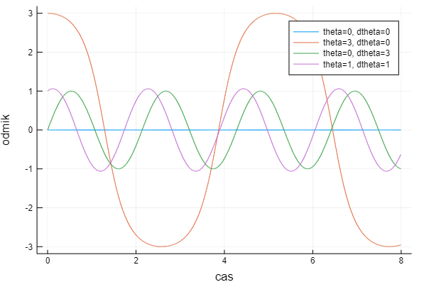
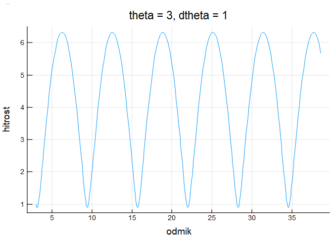
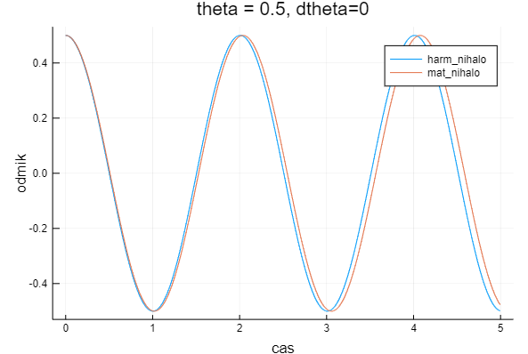
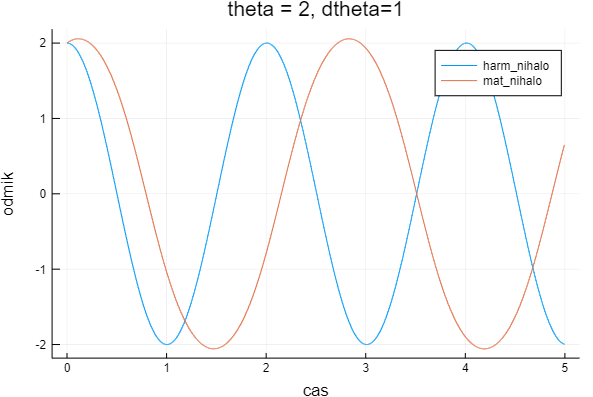
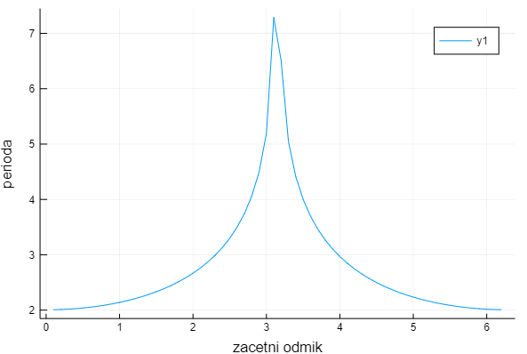
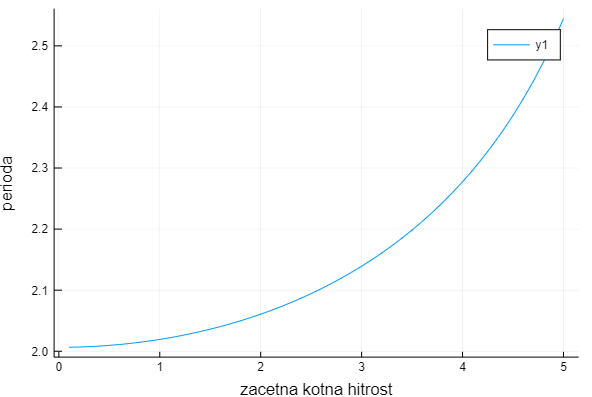

# Matematično nihalo

## Odmik nihala
[Matematično nihalo](https://en.wikipedia.org/wiki/Pendulum#Simple_gravity_pendulum) je idealiziran matematični model pravega nihala. 
Nihalo lahko opišemo z diferencialno enačbo:
```math
    {g\over l}\sin(\theta(t))+\theta^{\prime\prime}(t)=0, \quad \theta(0)=
    \theta_0,\ \theta^{\prime}(0)=\theta^{\prime}_0
```
Razvidno je, da je odmik nihala (v radianih) poleg gravitacijske konstante $`g=9.80665`$ in dolžine vrvi $`l`$, odvisen še od začetnega odmika $`\theta_0`$ in kotne hitrosti $`\theta^{\prime}_0`$. Če želimo izračunati kotni odmik moramo enačbo najprej prevesti na diferencialni sistem enačb prvega reda.

Definiramo nove spremenljivke in z njimi zapišemo enačbo:
```math
    y_1 = \theta(t)\\
    y_2 = \theta(t)^{\prime}\\
    y_3 = \theta(t)^{\prime\prime}\\
    y_1^{\prime} = y_2\\
    y_2^{\prime} = y_3\\
    \frac{g}{l}sin(y_1) + y_2^{\prime} = 0\\
```
ter definiramo nov sistem:
```math
F = \begin{bmatrix}
    y_2^{\prime} = \frac{g}{l}sin(y_1)\\
    y_1^{\prime} = y_2
    \end{bmatrix},
Y = \begin{bmatrix}
    y_2\\
    y_1
    \end{bmatrix},
Y_0 = \begin{bmatrix}
    \theta_0
    \theta_0^{\prime}
    \end{bmatrix}
```

Sistem diferencialnih enačb $`Y^{\prime} = F(Y_0)`$ lahko nato rešimo kot običajno diferencialno enačbo - na primer z metodo Runge-Kutta četrte stopnje:
```math
    \begin{array}{ccc}  
    k_1& = &h\,f(x_n,y_n)\\ 
    k_2& = & h\,f(x_n+h/2,y_n+k_1/2)\\ 
    k_3& = & h\,f(x_n+h/2,y_n+k_2/2)\\ 
    k_4& = & h\,f(x_n+h,y_n+k_3)\\ 
    y_{n+1}& = & y_n+(k_1+2k_2+2k_3+k_4)/6. \end{array}
```

Na spodnji sliki lahko vidimo vpliv začetnih pogojev na nihalo z dolžino $`l = 1`$. Vrednosti vplivajo tako na amplitudo kot na frekvenco nihanja. V nekaterih primerih, ko je začetni odmik okoli $`\pi`$ stopinj (nihalo je navpično zgoraj), je funkcija nihanja precej drugačna od običajnega sinusa saj potrebuje dlje časa, da doseže velik odmik, preden hitro pade dol. 



Pri veliki začetnih pogojih se lahko zgodi, da sistem ne niha več ampak se nihalo začne vrteti okoli svoje osi in nimamo več nihanja.



Za male odmike lahko matematično nihalo aproksimiramo s preprostim harmoničnim gibanjem po formuli:
```math
    \theta (t) = \theta_0cos(\sqrt{\frac{g}{l}}+konst.)
```
Na sliki vidimo, da se približa točni rešitvi za male odmike, pri večjih pa aproksimacija odpove.





## Nihajni čas
Glede na začetne pogoje (energijo nihala) se spreminja tudi nihajni čas ali perioda. Nihajni čas lahko pridobimo, tako da računamo kotni odmik, dokler ni le ta spet dosegel začetnega. Trenutni čas nato postane začetni približek periode, ki ga lahko uporabimo v Newtonovi metodi za doseg večje natančnosti. Iščemo namreč ničlo funkcije:
```math
    \theta (t) = \theta_0
    \theta (t) - \theta_0 = 0
```

Na sliki je viden vpliv začetnega odmika $`\theta_0`$ (od 0 do $`2\pi`$) in kotne hitrosti $`\theta^{\prime}_0`$ (od 0 do 5).





## Koda
```@autodocs
Modules = [NumMat, Base]
Pages = ["mat_nihalo.jl"]
Order   = [:function, :type]
```
