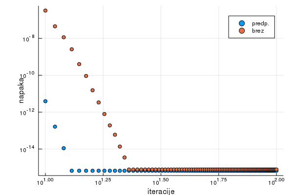

# Metoda konjugiranih gradientov s predpogojevanjem za razpršene matrike

Metoda konjugiranih gradientov je iteracijska metoda za reševanje sistema linearnih enačb 

```math 
Ax=b
```
Uporablja se za simetrično pozitivno definitne (SPD) matrike, ki so prevelikih dimenzij, da bi jih rešili z drugimi direktnimi metodami. Velikokrat so te matrike razpršene - vsebujejo veliko število ničelnih elementov.

Problem reševanja enačb lahko prevedemo na iskanje minimuma kvadratne funkcije 

```math 
f(x)=\frac{1}{2}x^TAx-x^Tb
```
ki je dosežen pri 

```math 
x=A^{-1}b
```
Vektor x določimo iterativno s formulo 

```math
 x_{k+1}=x_k+\alpha_kp_k 
``` 
kjer je $\alpha$ skalar, ki v smeri vektorja $p_k$ najbolj zmanjša vrednost funkcije $f(x)$. Smerni vektorji $p$ so med seboj konjugirani glede na matriko A ($p^TAp=0$), ker se tako hitreje premikamo proti minimumu.

## Predpogojevanje

Pred začetkom iterativne metode lahko matriko sistema transformiramo v obliko bolj primerno za računanje z izbrano metodo. Temu procesu se reče predpogojevanje. Pri konjugiranih gradientih je pogosto uporabljeno predpogojevanje z [nepopolnim Cholesky razcepom](https://en.wikipedia.org/wiki/Incomplete_Cholesky_factorization), ki matriko razcepi na (v našem primeru) spodnje trikotno matriko, tako da velja $A=L^TL$. Nepopolni Cholesky razcep je enak popolnemu Cholesky razcepu, le da ničelnih elementov matrike na spreminjamo. Tako hitro dobimo dovolj dober približek razcepa, ki nam pohitri konvergenco iterativnih metod. 

## Konvergenca
V okviru domače naloge sem na primerih dokazal, da s uporabo predpogojevanja, metoda konjugiranih gradientov konvergira hitreje, kot brez predpogojevanja. Za testiranje sem uporabljal naključno generirane razpršene SPD matrike, ki so v jeziku Julia shranjene v [Compressed Sparse Column (CSC)](https://docs.julialang.org/en/v1/stdlib/SparseArrays/) formatu.

V algoritmu za [konjugirane gradiente s predpogojevanjem](https://en.wikipedia.org/wiki/Conjugate_gradient_method#The_preconditioned_conjugate_gradient_method) ne računamo direktno inverza matrike $M$ pri $z=M^{-1}r$, ampak izpeljemo rezultat z uporabo lastnosti predpogojene matrike s Cholesky razcepom:

```math
M=L^TL\\
M^{-1}=(L^TL)^{-1}\\
z=M^{-1}r\\
Mz=r\\
L^TLz=r\\
Lz=L^T\setminus r\\
z=L\setminus (L^T\setminus r)
```

V primerjavi z metodo brez predpogojevanja, je konvergenca hitrejša, kot lahko vidimo na spodnji sliki:

```jldoctest
julia> range, data = compare_convergance(100, 1e-14)
julia> scatter(range, data, label=["predp.", "brez"], xlabel="iteracije", ylabel="napaka", scale=:log10);
```



Za matriko domenzij 100x100, metoda z predpogojevanjem do natančnosti 1e-16 konvergira v 4 korakih, medtem ko metoda brez predpogojevanja konvergira šele v 14 korakih. 

## Primer

Hitrejsa konvergenca s predpogojevanjem je opazna tudi v spodnjem primeru. V zameno za manjše število iteracij, je posamezna iteracija malo bolj zahtevna. Lahko omenimo tudi, da bolj kot je matrika diagonalno dominantna hitreje bo konvergirala. 

```jldoctest
julia> S = create_sparseSPD(100);
julia> @time L = nep_chol(S);
  0.427606 seconds (265.92 k allocations: 365.009 MiB, 25.50% gc time)
julia> b = rand(100,1);
julia> @time x,iter = conj_grad(S, b, L);
  0.010134 seconds (1.26 k allocations: 144.187 KiB)
julia> iter
10
julia> r = S*x - b;
julia> maxerr = maximum(abs.(r))
4.0740744111644744e-12

julia> @time x,iter = conj_grad_orig(S, b);
  0.068081 seconds (13.77 k allocations: 860.674 KiB)
julia> iter
17
julia> r = S*x - b;
julia> maxerr = maximum(abs.(r))
4.5218273569958e-12
```
